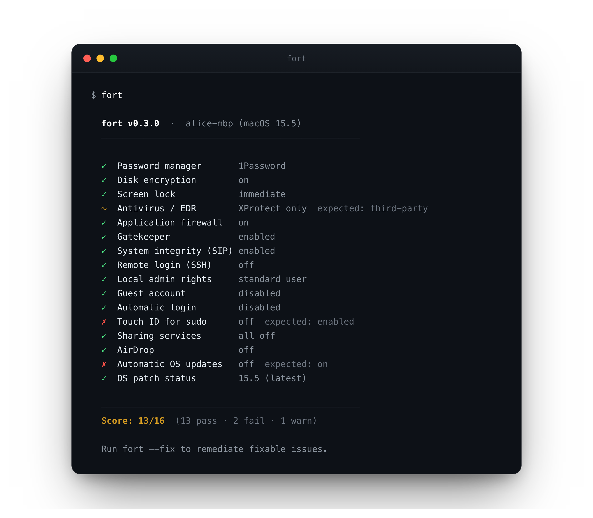
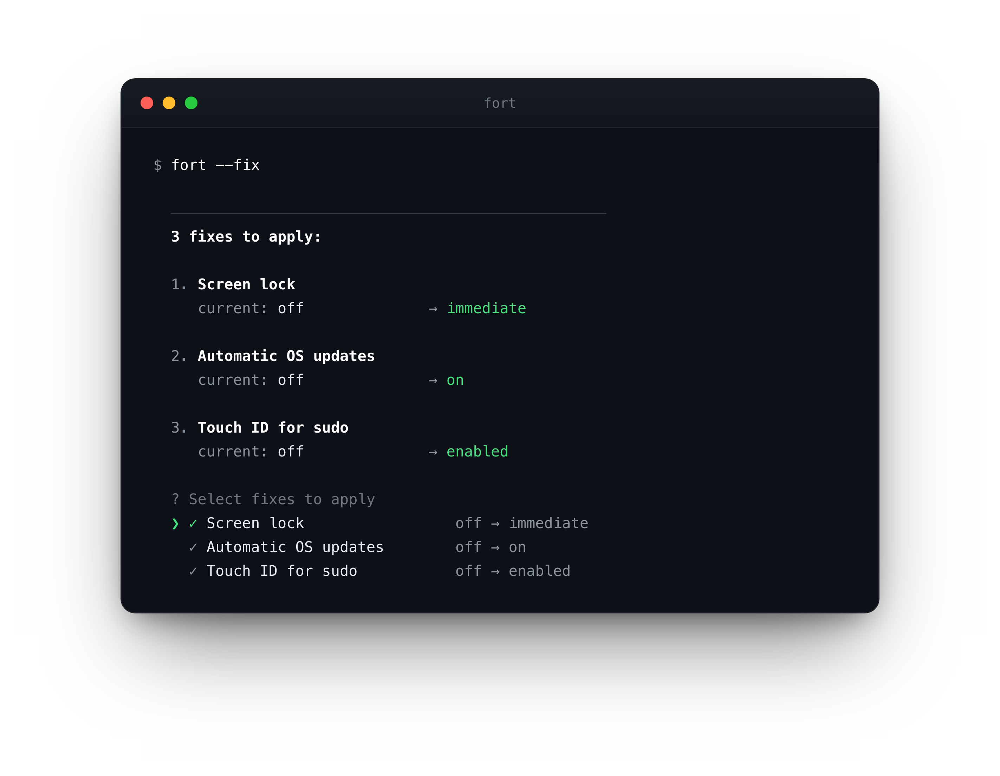
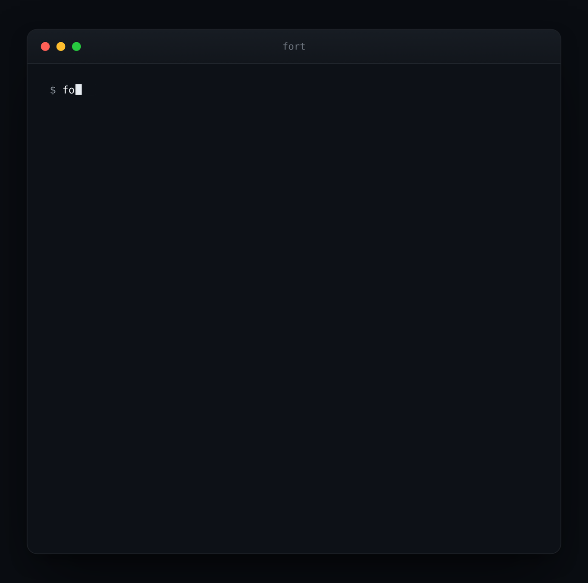

# fort

**Know your Mac's security posture, fix the gaps, and keep it locked down. One command.**

[](https://github.com/djadmin/fort/actions)
[](https://github.com/djadmin/fort/releases)
[](LICENSE)
[](https://github.com/djadmin/fort)

`fort` runs 15+ security checks on your Mac, fixes what it safely can, and writes an auditor-ready report. No agent, no signup, no MDM enrollment. Just a single binary.

Good for anyone who wants to harden their Mac. Essential for teams preparing for SOC 2 or ISO 27001.

**[djadmin.github.io/fort](https://djadmin.github.io/fort)**

 

`fort` audits every control and shows where you stand. `fort --fix` reviews each change, then applies, after you confirm.

<details>
<summary><b>Watch a full run</b></summary><br>

</details>

## Install

**Homebrew** _(recommended)_
```bash
brew install djadmin/tap/fort
```

**Direct download (macOS, Apple Silicon + Intel)**
```bash
curl -fsSL https://github.com/djadmin/fort/releases/latest/download/fort_darwin_all.tar.gz | tar xz && sudo mv fort /usr/local/bin/
```

**Go**
```bash
go install github.com/djadmin/fort/cmd/fort@latest
```

**Build from source**
```bash
git clone https://github.com/djadmin/fort.git
cd fort && make install
```

**Update**
```bash
brew upgrade djadmin/tap/fort
```

## Usage

```bash
fort                          # audit your Mac
fort --dry-run                # preview what --fix would change; nothing is applied
fort --fix                    # audit, show confirmation prompt, apply selected fixes
fort --fix --yes              # skip prompt; for scripts, MDM push, or cron
fort --json                   # structured JSON output for automation
fort --report                 # write fort-report-YYYY-MM-DD.html (print to PDF)
fort --only filevault,firewall  # run only the specified checks (comma-separated IDs)
```

Exit codes: `0` all pass · `1` any fail · `2` any warn

## Safe by design

- **The audit makes no network calls.** `fort` reads local system state and exits. Nothing is uploaded, no account, no telemetry.
- **No black box.** Every check prints the exact command it ran and its raw output, in the terminal, the JSON, and the HTML report. Verify it instead of trusting it.
- **`--fix` always asks first.** It shows each change and prompts `[y/N]` before applying. Use `--dry-run` to preview without touching anything, or `--yes` to skip the prompt when you mean to (automation, cron, MDM).
- **One MIT-licensed Go binary.** No agent, no background process, nothing installed system-wide. Read the source.

## What it checks

15+ macOS checks across five groups, each mapped to SOC 2, ISO 27001, NIST CSF, and CIS v8:

| Group | Checks |
|-------|--------|
| Core security | password manager, FileVault, screen lock, antivirus / EDR |
| System hardening | firewall, Gatekeeper, SIP, SSH |
| Access controls | local admin rights, guest account, automatic login, Touch ID for sudo |
| Exposure reduction | sharing services, AirDrop |
| Patching | automatic OS updates, OS patch status |

The exact set grows over time. Run `fort` to see every check on your machine, and the [changelog](CHANGELOG.md) for what's new.

## JSON output

```json
{
  "tool": "fort", "version": "0.3.0", "hostname": "alice-mbp",
  "os_version": "15.5", "timestamp": "2026-06-09T10:00:00Z",
  "summary": { "total": 16, "pass": 12, "fail": 2, "warn": 2, "score": "12/16" },
  "policies": [{ "id": "filevault", "status": "pass", "current": "on",
    "evidence": "$ fdesetup status\nFileVault is On.",
    "frameworks": { "SOC 2": ["CC6.1", "CC6.7"], "ISO 27001": ["A.8.3"] } }]
}
```

`fort --report` writes a self-contained HTML evidence report: machine identity, serial number, OS version, timestamp, per-check results with the exact commands run and their verbatim output, and framework control references. Opens locally or prints to PDF. See a [sample report](https://djadmin.github.io/fort/sample-report.html).

## Contributing

PRs welcome. To add a check:

1. Create `internal/checks/yourcheck_darwin.go` and implement the `Check` interface
2. Register in `internal/checks/registry_darwin.go`
3. Add framework mappings in `internal/checks/frameworks.go`
4. Run `go test ./...`; existing tests enforce interface contracts

## License

[MIT](LICENSE)
