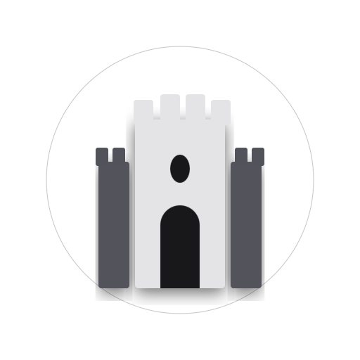
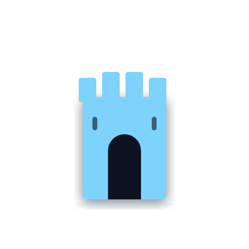
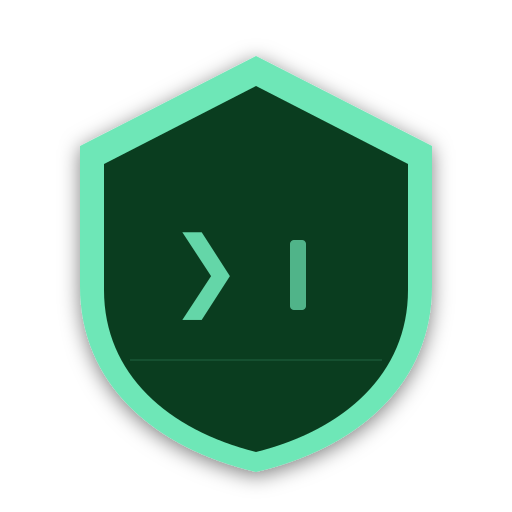
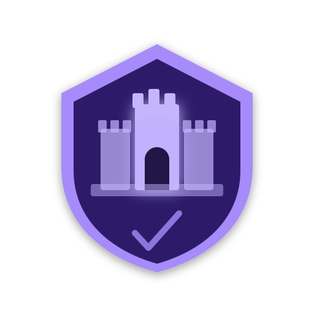
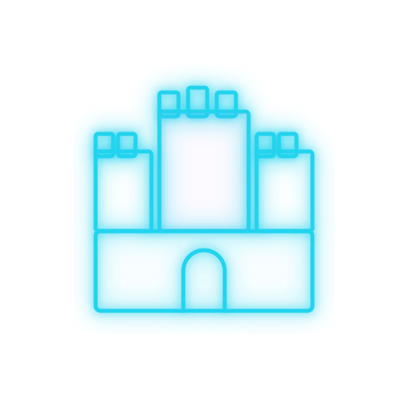
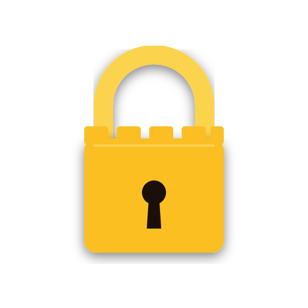
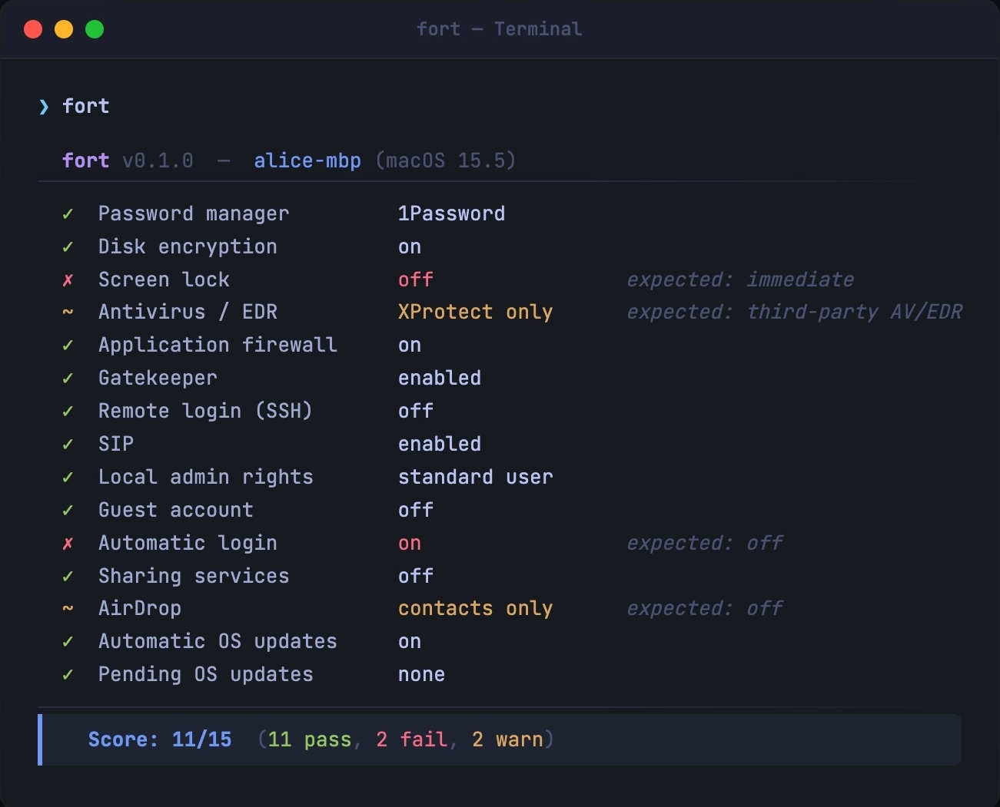
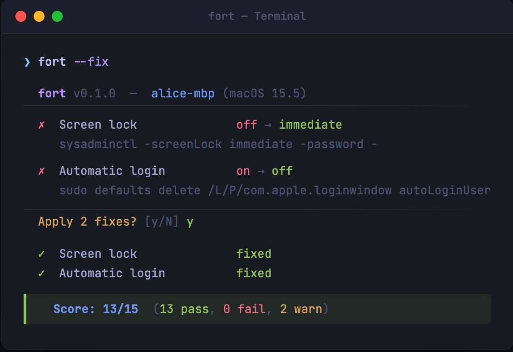

# fort

<!-- LOGO-PICKS-START — temporary; remove once chosen -->
## Logo picks (temporary)

<table>
<tr>
<td align="center" width="33%"><br><sub><b>obsidian-tower</b></sub></td>
<td align="center" width="33%"><br><sub><b>glowing-turret</b></sub></td>
<td align="center" width="33%"><br><sub><b>emerald-shield</b></sub></td>
</tr>
<tr>
<td align="center"><br><sub><b>fortress-shield</b></sub></td>
<td align="center"><br><sub><b>neon-fort</b></sub></td>
<td align="center"><br><sub><b>lock-emblem</b></sub></td>
</tr>
</table>

Favicon-size sanity check (16px — the real survival test):

<p>
   obsidian-tower &nbsp;
   glowing-turret &nbsp;
   emerald-shield &nbsp;
   fortress-shield &nbsp;
   neon-fort &nbsp;
   lock-emblem
</p>

<!-- LOGO-PICKS-END -->

**Know your Mac's security posture. Fix gaps. Prove compliance. One command.**

`fort` runs 15 security checks on your Mac, remediates what it can, and produces an auditor-ready report. No agent, no signup, no MDM enrollment — just a single binary.

Good for anyone who wants to harden their Mac. Essential for teams preparing for SOC 2 or ISO 27001.

**[djadmin.github.io/fort](https://djadmin.github.io/fort)**

<table><tr>
<td></td>
<td></td>
</tr></table>

## Install

[](https://github.com/djadmin/fort/actions)
[](https://github.com/djadmin/fort/releases)
[](LICENSE)
[](https://github.com/djadmin/fort)

**Homebrew** _(recommended)_
```bash
brew install djadmin/tap/fort
```

**Direct download (macOS — Apple Silicon + Intel)**
```bash
curl -fsSL https://github.com/djadmin/fort/releases/latest/download/fort_darwin_all.tar.gz | tar xz && sudo mv fort /usr/local/bin/
```

**Go**
```bash
go install github.com/djadmin/fort/cmd/fort@latest
```

**Build from source**
```bash
git clone https://github.com/djadmin/fort.git
cd fort && make install
```

**Update**
```bash
brew upgrade djadmin/tap/fort
```

## Usage

```bash
fort                # audit your Mac
fort --dry-run      # preview what --fix would change — nothing is applied
fort --fix          # audit, show confirmation prompt, apply selected fixes
fort --fix --yes    # skip prompt — for scripts, MDM push, or cron
fort --json         # structured JSON output for automation
fort --report       # write fort-report-YYYY-MM-DD.html (print to PDF)
```

Exit codes: `0` all pass · `1` any fail · `2` any warn

## What It Checks

15 macOS checks across five groups, each mapped to SOC 2, ISO 27001, NIST CSF, and CIS v8:

| Group | Checks |
|-------|--------|
| Core security | password manager, FileVault, screen lock, antivirus / EDR |
| System hardening | firewall, Gatekeeper, SIP, SSH |
| Access controls | local admin rights, guest account, automatic login |
| Exposure reduction | sharing services, AirDrop |
| Patching | automatic OS updates, OS patch status |

## JSON output

```json
{
  "tool": "fort", "version": "0.1.1", "hostname": "alice-mbp",
  "os_version": "15.5", "timestamp": "2026-05-28T10:00:00Z",
  "summary": { "total": 15, "pass": 11, "fail": 2, "warn": 2, "score": "11/15" },
  "policies": [{ "id": "filevault", "status": "pass", "current": "on",
    "frameworks": { "SOC 2": ["CC6.1", "CC6.7"], "ISO 27001": ["A.8.3"] } }]
}
```

`fort --report` writes a self-contained HTML evidence report — machine identity, timestamp, per-check results, and framework references. Opens locally or prints to PDF.

## Contributing

PRs welcome. To add a check:

1. Create `internal/checks/yourcheck_darwin.go` — implement the `Check` interface
2. Register in `internal/checks/registry_darwin.go`
3. Add framework mappings in `internal/checks/frameworks.go`
4. `go test ./...` — existing tests enforce interface contracts

## License

[MIT](LICENSE)
