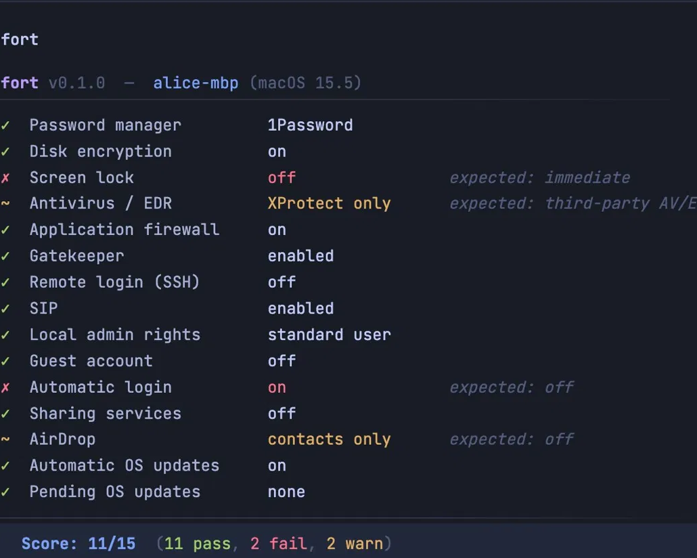
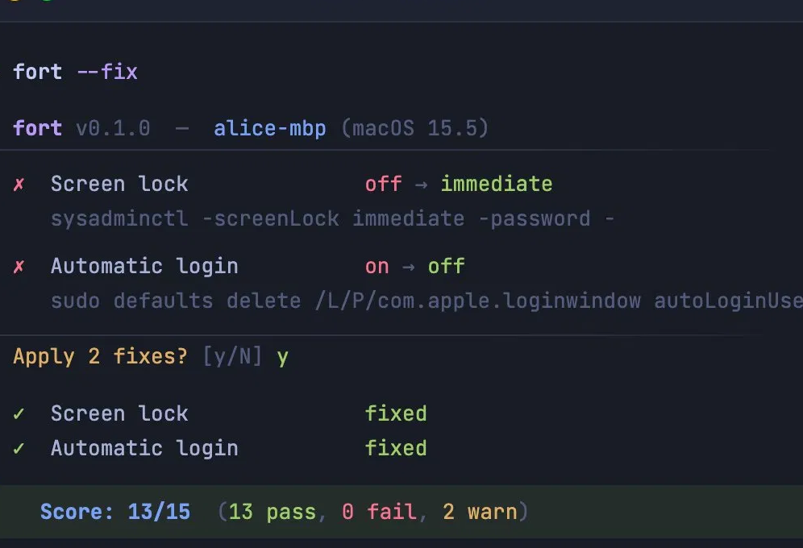

# fort

**Audit, fix, and prove macOS endpoint security from one command.**

`fort` is a macOS CLI for teams that need fast, auditable endpoint checks without standing up MDM first. It inspects local security settings, can remediate the fixable ones, and can emit both machine-readable JSON and an auditor-friendly HTML report.

Built for startups preparing for SOC 2, consultants running client readiness reviews, and BYOD environments that need evidence without full device enrollment.

**[djadmin.github.io/fort](https://djadmin.github.io/fort)**





```text
$ fort

  fort v0.1.0  —  alice-mbp (macOS 15.5)
  ───────────────────────────────────────────────────────────────────

  ✓  Password manager         1Password
  ✓  Disk encryption          on
  ✗  Screen lock              off                         expected: immediate
  ~  Antivirus / EDR          XProtect only              expected: third-party AV/EDR
  ✓  Application firewall     on
  ✓  Gatekeeper               enabled
  ✓  Remote login (SSH)       off
  ...

  ───────────────────────────────────────────────────────────────────
  Score: 11/15  (11 pass, 2 fail, 2 warn)

  Run fort --dry-run to preview fixes, or fort --fix to apply with confirmation.
```

## Status

- macOS 12+ today
- Single local binary, no agent, no signup
- 15 built-in checks mapped to SOC 2, ISO 27001, NIST CSF, and CIS v8

## Install

**Download (macOS — Apple Silicon + Intel)**
```bash
curl -fsSL https://github.com/djadmin/fort/releases/latest/download/fort_darwin_all.tar.gz | tar xz && sudo mv fort /usr/local/bin/
```

**Go**
```bash
go install github.com/djadmin/fort/cmd/fort@latest
```

**Build from source**
```bash
git clone https://github.com/djadmin/fort.git
cd fort && make install
```

Homebrew tap coming soon: `brew install djadmin/tap/fort`

## Usage

```bash
fort                # audit your Mac
fort --dry-run      # preview what --fix would change — nothing is applied
fort --fix          # audit, show a confirmation prompt, then apply fixes
fort --fix --yes    # skip the prompt — for scripts, MDM push, or cron
fort --json         # structured JSON output for scripts and dashboards
fort --report       # write fort-report-YYYY-MM-DD.html (print to PDF)
```

`--dry-run` shows the exact command each fix would run before anything touches your system. `--fix` always asks `[y/N]` by default — use `--yes` to skip in automated contexts.

Exit codes: `0` all pass · `1` any fail · `2` any warn

## What It Checks

`fort` currently ships 15 macOS checks across five groups:

| Area | Checks |
|------|--------|
| Core security | password manager, FileVault, screen lock, antivirus / EDR |
| System hardening | firewall, Gatekeeper, SIP, SSH |
| Access controls | local admin rights, guest account, automatic login |
| Exposure reduction | sharing services, AirDrop |
| Patching | automatic OS updates, pending OS updates |

Each result includes framework mappings in both JSON and HTML report output.

## Outputs

`fort --json` produces a stable JSON payload designed for scripts, collectors, and dashboards:

```json
{
  "tool": "fort",
  "version": "0.1.0",
  "hostname": "alice-mbp",
  "serial": "C02X...",
  "os_version": "15.5",
  "timestamp": "2026-05-21T10:30:00Z",
  "summary": { "total": 15, "pass": 11, "fail": 2, "warn": 2, "score": "11/15" },
  "policies": [...]
}
```

`fort --report` writes a self-contained HTML evidence report with machine identity, timestamp, per-check status, fix markers, and framework references. The file has no server dependency and can be opened locally or printed to PDF.

## Positioning

`fort` is not an MDM replacement. It is the fast path to:

- understand a Mac's current security posture
- remediate obvious gaps
- produce evidence an auditor or client can review

Compared with larger tools, the value is speed, transparency, and a workflow that starts with one command instead of enrollment and SaaS setup.

## Repository Layout

| Path | Purpose |
|------|---------|
| `cmd/fort` | CLI entrypoint, output, and report generation |
| `internal/checks` | macOS checks and framework mappings |
| `cmd/landing` | optional landing-page waitlist server |
| `landing` | static marketing site assets |

## Contributing

PRs are welcome.

1. Add a new check under `internal/checks`.
2. Register it in `internal/checks/registry_darwin.go`.
3. Add framework mappings in `internal/checks/frameworks.go`.
4. Run `go test ./...`.

New checks should use documented macOS interfaces, work on supported macOS versions, and have clear pass/fail semantics.

## License

[MIT](LICENSE)
